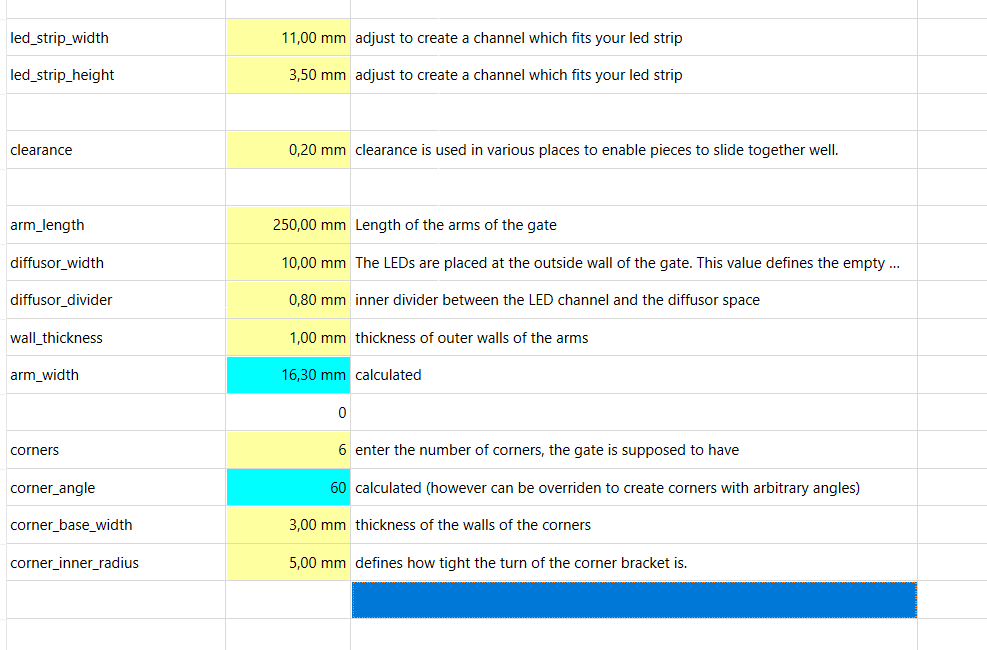

# Intro
This FreeCad Model to create fully parametric parts to build gates for inddor whoop flying.

Currently it's heavily work in progress. 

## Parametric

The design is created as parametric as possible so it can be adjusted to different led strips, gate sizes, number of gate corners, arbitrarily angled corners etc.. The parameters can be set in a spreadsheet within the model. 

## LEDs
The gates are designed to be lit with LED strips, addressable or not. WLED as a firmware for an ESP32 or ESP8266 seems to be a perfect fit as it also allows for monitoring the battery voltage with a user extension. This way, the System can be powered with LIPOs and switch off when the LIPOs get too empty. More details will follow once I have it built. 

## Prototypes
Here's an image of the first gate I'm building:

